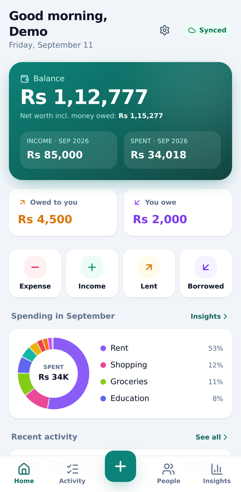
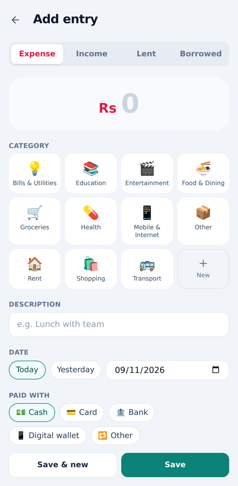
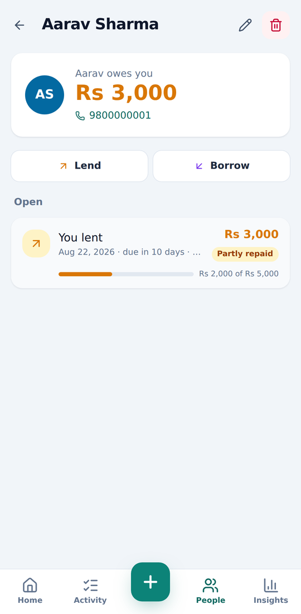
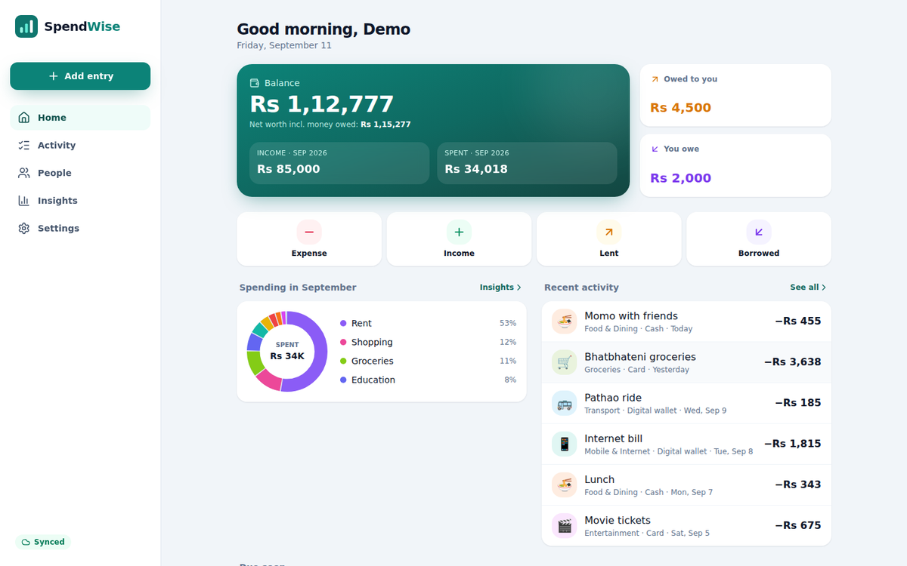

# SpendWise

**Offline-first personal finance app** — track income, expenses, money you lend
and borrow, and repayments. Installable on Android as a Progressive Web App and
usable in any desktop browser. Everything works without internet and syncs to
your account when you're back online.

<p align="center">
  
  
  
</p>
<p align="center">
  
</p>

## What V1 does

- **Accounts** — register/login, JWT with rotating refresh tokens, per-user data isolation
- **Income & expenses** — amount, category, date, description, payment method, notes; edit/delete; search & month filter
- **Categories** — 16 defaults (Food, Transport, Rent, Salary…) plus your own with icon & colour
- **People, lending & borrowing** — who owes you, whom you owe, due dates, overdue flags
- **Repayments** — partial or full; outstanding balance and status (open / partly repaid / overdue / settled)
- **Dashboard** — balance, net worth, month income/spend, owed to you / you owe, spending donut, recent activity, loans due soon
- **Insights** — spending by category, 6-month income vs expenses, daily spending, savings rate, change vs last month
- **PWA** — installable, app icon & shortcuts, works offline, update prompt
- **Offline-first sync** — local IndexedDB store, sync queue with pending/syncing/synced/failed states, retries with backoff, duplicate protection, multi-device conflict rules
- **Mobile-first UI** — bottom navigation + big "+" button on phones, sidebar on desktop, light/dark themes, 12 currencies (NPR default, lakh grouping)

## Quick start

```bash
npm install
cp backend/.env.example backend/.env     # set DATABASE_URL + JWT_SECRET
npm run db:migrate                       # create tables
npm run db:seed                          # optional: demo@spendwise.app / demo1234
npm run dev                              # API :4000 + app :5173
```

Or everything in Docker: `docker compose up --build` → http://localhost:4000

Windows steps, production deployment, and installing on Android:
**[docs/DEPLOYMENT.md](docs/DEPLOYMENT.md)**.

## Tech stack

React 19 · Vite 7 · Tailwind CSS 4 · React Router 7 · Axios · Recharts ·
Dexie (IndexedDB) · vite-plugin-pwa (Workbox) · Node.js · Express 5 · Zod ·
JWT + bcrypt · PostgreSQL · Prisma 6 · Vitest · Supertest · Playwright

## Project layout

```
shared/     money + finance logic used by both frontend and backend
backend/    Express REST API, Prisma schema & migrations, API tests
frontend/   React PWA (pages, IndexedDB store, sync engine), engine tests
e2e/        Playwright end-to-end run + screenshot script
docs/       documentation (below) + SpendWise-Documentation.pdf
```

## Scripts

| Command | What it does |
| --- | --- |
| `npm run dev` | API + web app with hot reload |
| `npm run build` | Production build of the PWA (`frontend/dist`) |
| `npm start` | Serve API **and** the built PWA on :4000 |
| `npm run db:migrate` / `db:deploy` | Create/apply migrations (dev / production) |
| `npm run db:seed` | Demo account with 3 months of data |
| `npm test` | 62 unit + API + offline-engine tests |
| `npm run test:e2e` | 20-step browser test incl. offline mode (app must be running) |

## Documentation

| Doc | Contents |
| --- | --- |
| [User guide](docs/USER_GUIDE.md) | How to use every screen, what the sync icons mean |
| [Architecture](docs/ARCHITECTURE.md) | System design, folder structure, data model, money handling |
| [Offline & sync](docs/SYNC.md) | Outbox, push/pull, retries, duplicate protection, conflict rules |
| [API reference](docs/API.md) | Every endpoint, request/response shapes, error codes |
| [Deployment](docs/DEPLOYMENT.md) | Local setup (incl. Windows), Docker, hosting, Android install |
| [Security](docs/SECURITY.md) | How each security requirement is met |
| [Testing](docs/TESTING.md) | Test suites, coverage of the testing strategy, latest E2E run |
| [Roadmap](docs/ROADMAP.md) | What's next: V2 → V5 |
